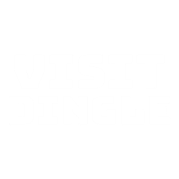
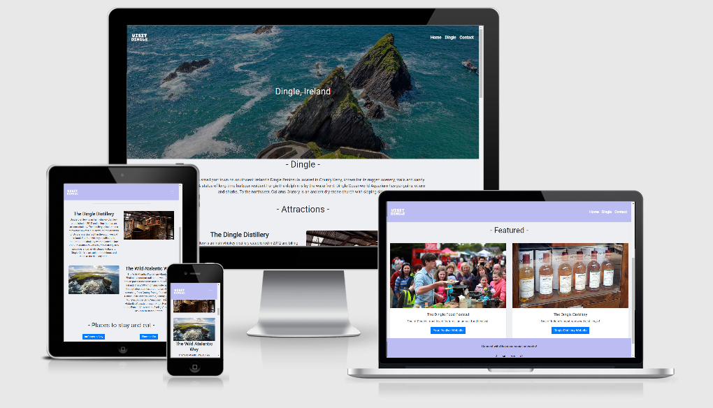
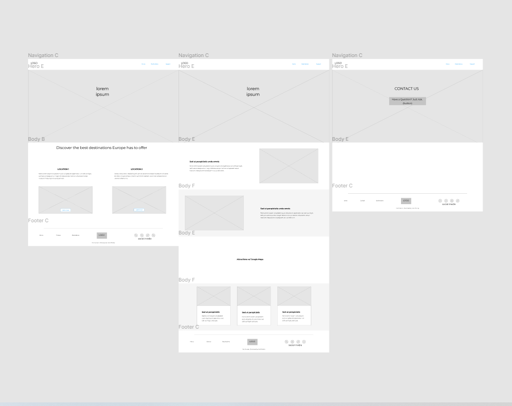
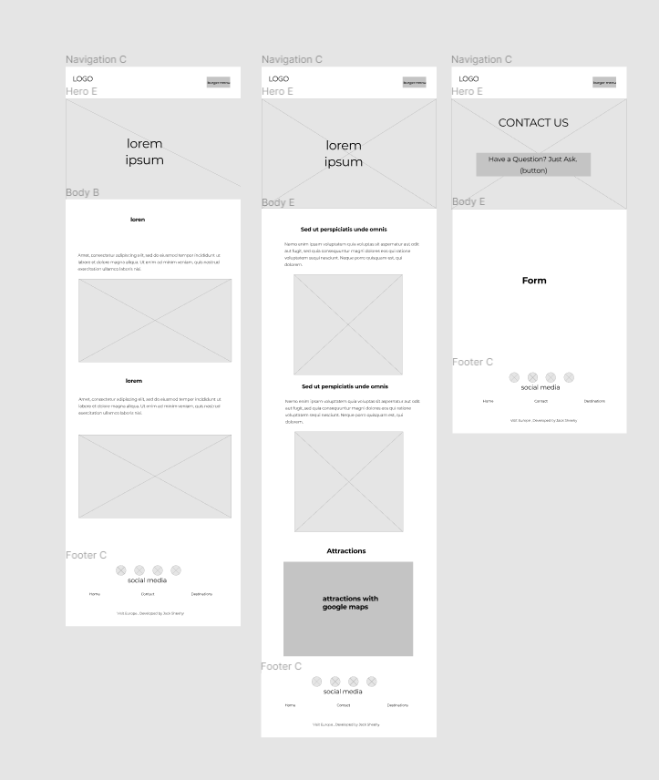

# Milestone Project 2 - Fest Finder
View live project <a href="">here
***
## Table of Contents
* [What does it do and what does it need to fulfill?](#what-does-it-do-and-what-does-it-need-to-fulfill)
* [User Experience](#user-experience)
   * [User Stories](#user-stories)
   * [Design](#design)
       * [1. Colour Scheme](#colour-scheme)
       * [2. Font](#font)
       * [3. Logo](#logo)
       * [4. Composition](#composition)
       * [5. Wireframes](#wireframes)
* [Technologies Used](#technologies-used)
* [Features](#features)
   * [Existing Features](#existing-features)
   * [Future Features](#future-features)
* [Testing](#testing)
* [Deployment](#deployment)
    * [Host on Github Pages](#host-on-github-pages)
    * [Running Project Locally](#run-your-project-locally)
* [Credits](#credits)
    * [Content](#content)
    * [Code](#code)
    * [Media](#media)
* [Acknowledgements](#acknowledgements)
***

## 

### Visit Dingle Logo

***
## **What does it do and what does it need to fulfill?**
This is my second milestone project where I have designed, created and built a fully responsive and interactive website for my hometown Dingle. 
My goals with this website are to attract new people to Dingle and to present users with the information that should attract them to visiting Dingle.

I have taken my knowledge learned from the first five modules of the Full Stack Software Developer course, (HTML Fundamentals, CSS Fundamentals, User Centric Frontend 
Development, JavaScript Fundamentals and Interactive Frontend Development Modules) to provide a clear, functioning and responsive website that 
demonstrates a proficient use of HTML5, CSS3 and JavaScript. The Bootstrap Framework was used along side these programming languages to help give
the site a clear strucutre and ensure the site has a high standard of responsiveness on desktop, tablet and
mobile. The jQuery framework was used amoungst my own JavaScript code for easier implementation of some code.

## **User Experience**

## User Stories:

* User Goals:
    * As a user, I want to be able to navigate through the entire site, comfortably and securely.
    * As a user, I want to be able to easily contact the site with any initial queries that I may have, submit questions, and recieve an
    acknowledgement of my message being received, and a due response.
    * As a user, I want to learn more about Dingle and where it is situated, and what can be seen and done there. This includes information
    such as where to eat and where to stay.
    * As a user, I want to be able to follow links from the designated location to the main website of interest.
    * As a user, I want to learn about the attractions the town has.
    * As a user, I want to feel comfortable and informed about visiting Dingle.
    * As a user, I want to be able to access the site's social media accounts in order to learn more.
    
* For the user, the site assists in meeting the user goals by:
    * Presenting a clean website that's easy-on-the-eye, providing smooth navigation with the use of a fixed navbar.
    This enables them to click between the pages at all times. The user can also click on the logo from
    any page to take them back to the home page.
    * Providing a clean, basic form that doesn't overwhelm or confuse the user which they can fill out to submit any questions they may have.
    Upon submission the user gets a modal pop up providing them with feedback that their query has been submitted successfully.
    * The footer contains all the social media links the user will need to use for follwing and learning more about this site.
  

[Back to Top](#table-of-contents)

#### Design
##### Colour Scheme

I chose colors that would be soothing and calming on first glance of the website, and not intrusive. The muted tones give the page a serene look
and feel. This was important to me as my aim was to create an online space that promotes and represents a feeling of what colours can be pleasent for the user to look a. I feel like the light and dark purple contrast
well on the navbar and footer and also the light gray background color is pleasent for the user.

Colours I used are:
* f5f5f5 - Light Gray - Primary Color
* bbbdf2 - Light Purple - Header Colour
* 848d9c - Lighter Purple - Secondary Footer Colour
* 4278f5 - Dark Blue - Button Hover color

The primary colour, Light Grey (f5f5f5), was used throughout the pages to give the whole site consistency. I found that it gives the page a nicer
overall feeling and makes the text less harsh on the eye and therefoere easier to read.
 
The secondary color, Light Purple (bbbdf2), was used for the Navbar and the footer. I felt as if this was an appropriate color as it fits nicely with the colors from the festival hero images.

 

I also used a lighter shade of Purple (848d9c) for the footer also, to give it nice contrast. I think it went well with the original color of purple I have already selected throughout the site.
 
I used Dark Blue (4278f5) as a color for when the user hovers over a button and social media icons, I felt as if it was a nice color to use, it's subtle.
[Back to Top](#table-of-contents)

### Font

I decided to use two fonts throught my site. I included these fonts by inserting an _import_ link of Google Fonts API into the top of my html documents 
The font I chose for the body text on the pages was 'Roboto', with a fall back of 'Sans-serif' should the site not load the import correctly. I
found the 'Roboto' font was clear, easy to read and fed into the simple, minimal look and feel I was trying to achieve with the site.
 Clarity was important throughout my project and I felt as though Roboto was a safe, reliable font to use.
When it came to font weight, I used to stock font weight for most of the page except the titles , I used the 'large' font size.

###  Logo

The logo was created using an online design tool called Free Logo Design. I created a custom canvas to fit my required dimensions and set the background to
be transparent as I was using a transparent navbar. when it came to designing the logo I typically like a plain yet attrctive logo so I used a simple "Visit Dingle" text in the color white.
i picked the color white for the logo so It would have a nice contrast between the purple navbar and also, the color white looks nice on the raw hero images 
found on the website before you scroll when the navbar goes purple.
It also matched the white font of my nav links on the navbar. I chose the font 'Roboto' for this text to match the font used for headings throughout the
site, keeping a clear consistency. It suited the site's branding and complemented all my other design choices well. 

### Composition

There is a clear structure throughout the site. Each of the main pages has a hero image at the top with some text to engage the user. I also implemented content
hinting on all the pages to encourage scrolling and more user interaction. 
To help me keep the design neat and consistent, I had all content displayed central, with good margins for desktop use to avoid anything being cut
off the screen. I ensured all the content is full width for mobile sizes, utilising all of the space available. I feel like scrolling down 
on the home page ave it a nice touch which greeted the user with 2 pieces of information regarding Dingle.
The Google map on the Dingle page has been set to full
width to keep the map easily readable across all screen sizes. 

###  Wireframes

Wireframes for this project were created using Figma. I did enjoy the wireframing part of this project because that is where I can 
see if something will work or not on the site.
The final pages I ended up with arent too different than my wireframes I believe.
made during the planning stages. Find the links to these wireframes below:

 ## **Technologies Used**

 ### Languages

 * [HTML5](https://en.wikipedia.org/wiki/HTML5) - Language used to create the structure of the pages.

 * [CSS3](https://en.wikipedia.org/wiki/Cascading_Style_Sheets) - Language used to add styling across all pages.

* [JavaScript](https://en.wikipedia.org/wiki/JavaScript) - Language used to create interactivity across the pages.

### Libraries, Frameworks and Editors

* [Bootstrap 4.5.0](https://getbootstrap.com/) - used to create basic HTML layout and structure and using Bootstrap's CSS Framwework. The
resposnsive grid system was utilised well.

* [Google Fonts](https://fonts.google.com/) - was used to import the 'Roboto' and 'Noto Sans' fonts, that were used across all pages.

* [Font Awesome](https://fontawesome.com/) - was used for the social icons and the calender link found in the footer.

* [jQuery](https://jquery.com/) - was used in conjunction with Bootstrap to create the navbar collapse element, opacity of the navbar on the scroll
of the page, and the modal pop up on submission of the contact form.

* [EmailJS](https://www.emailjs.com/) - was used to send an email from JavaScript to my Gmail account.

* [Favicon.io](https://favicon.io/) - was used to generate the favicon image.

* [Git](https://git-scm.com/) - used for version control by making use of the Gitpod terminal to add, commit and push to Github.

* [Github](https://github.com) - used to host the project's repository and store the code, as well as host the website on Github pages.

* [Google Images](https://google.com) - used to find images for use across the site.

[Back to Top](#table-of-contents)
### Tools

* [Google](https://www.google.com/) - was used for researching various techniques, styles and information.

* [Google Chrome DevTools](https://developers.google.com/web/tools/chrome-devtools) - used for testing and debugging.

* [Google Maps](https://www.google.co.uk/maps) - used to grab the coordinates of locations and get details of locations -
websites.

* [Google Developers](https://developers.google.com/maps/documentation/?_ga=2.257569803.1237416838.1604925384-1643581518.1600963572) - used for
reading and learning the documentation best advised by Google to implement Google Maps and Places API.

* [Figma](https://www.figma.com/) - used for creating the wireframes in the design stage.

* [Free Logo Design](https://www.freelogodesign.org/) - was used to design and create the logo, create the favicon logo, and also to resize images to specific dimensions.

* [Am I Responsive](http://ami.responsivedesign.is/) - used for showing the responsiveness of the site across different screen sizes and providing
the image at the top of this document.

* [Free Online HTML Formatter](https://www.freeformatter.com/html-formatter.html#ad-output) - used to format the HTML code in a neater and more
organised fashion.

* [Free Online CSS Formatter](https://www.freeformatter.com/css-beautifier.html) - used to format the CSS code in a neater and more organised
fashion.

* [Free Online JS Formatter](https://www.freeformatter.com/javascript-beautifier.html) - used to format the JavaScript code in a neater and more
organised fashion.

## **Features**

#### Existing Features

* Navbar - Featured across all pages. Site visitors can use the links on the left to navigate between all pages on the website. These links also
collapse down into a hamburger icon at smaller screen sizes. The logo, found on the left, can be clicked on all pages to take users back to the
home page. The navbar is also fixed, which enables the user to easily navigate between the pages of the website. The navbar starts off as transparent,
and then becomes purple as the user scrolls to ensure it is always clear and legible.

* Footer - Also featured across all pages. Users will find clickable social icons linking to the corresponding social media pages i.e facebook, twitter, tripadvisor, instagram.
There is also a copyright section at the bottom of the footer.

* Hero images -  These can be found across the three main pages (Home, Dingle, Contact, and provide a visual reference to what the user
can expect to find and experience in Dingle.

* Home Page - This page showcases a hero image of the fihing port in Dingle as the hero image, then there is a featured section with image 
and text based on the Dingle Food Festival and The Dinge Distillery, the two content sections also have links to a designaed website related to 
the content and then this is followed by The footer.

* Experience Page - This page was created to help the user understand what Dingle has to offer. It makes use of Google Maps API, incorporating
clickable buttons above the map to make the user interact with the map. On the click of each button, markers will drop on the map.
When the user clicks on the marker a little information box will pop up, giving a litle rundwon of the location and a link to the designated website of said location. 
I felt the user would be overwhelmed if the map presented them with every single resaurant and hotel in Dingle, so I used my extensive knowledge of Dingle to hand 
pick 4 of the best restaurants and 4 of the best Hotels around and put them on the map. 
I had a major issue in regards to the Google Maps API which took me quite some time to figure out but thanks to Stack Overflow and CI Tutors I got it working eventually.

* Contact Page - This page provides a form users can fill out to contact the site. They can use this for general enquiries. Once the user submits
the form, they will be presented with a modal pop up thanking them for their message and that they chould expect a response. 
This provides the user with feedback that the query has gone through successfully. It is
important to provide feedback to the user so they feel their actions have been validated.

* Back-to-Top Button - Each page contains a back-to-top button that will appear when the user scrolls to a set pixel height down the page, giving
the user easier navigation around the pages and the site. 

* Favicon Icon - When the user loads the web pages, a favicon image of "EIRE" appears in the tab at the top next to the
name of the site. I picked EIRE for this because I felt as if it was a nice personal touch because Eire is Irish for Ireland
 
 [Back to Top](#table-of-contents)
#### Future Features

* Gallery Page - A seperate page to showcase images of Dingle and visitors' experiences of the range of activities, drives, walks etc. on offer.
This would give the user a more concrete idea of what to expect from a visit to Cornwall.

* Include more markers and information on the Google Map to give the user an even more extensive view of what Dingle has to offer.

* On the scroll of the page, the hero image would zoom out.

[Back to Top](#table-of-contents)

## **Testing**

### **Testing User Stories:**
- New user - *I am thinking of visiting Dingle and would like to get the information neccessary to visit* - 
On the homepage, the user is met with a top-stuck navigation menu, containing **Home**, **Dingle** and **Contact**.
There is then a picture of Dingle Harbor which teases Dingle is like to the new user.
There is then images and text related to the Food Festival and Dingle Distillery..
The footer at the bottom of the page consists of social media icons that the user can navigate through.
The Dingle page would be the main point of interest for the user , as there is alot of tempting images and contnent to be found there like attractions and activities.
The user can then navigate to the contact page where they will be greeted with a form and can get in contact with us regarding any questions they have.

Returning user - *I want to ask a question related to Dingle , because it is possible I will visit* - The user can easlily navigate to the **Contact** page where 
they can submit a form with their quesion - or else , the user can navigate to the botom of the page where they can find our social media links and they can pursue in asking questions there.

Business owner - *As the business owner I want to see a consistent style throughout the whole webpage* - The business owner can navigate throughout the website and they will notice that the navbars are consistent
design The footers are consistent across all 4 pages also. The header font used is consistent across the site and the font used is consistent for all paragraphs. The site is a well balanced site in regards to colors, It is easy on
they eyes and is nicely designed throughout.

[Back to Top](#table-of-contents)

### **Validating The Code:**
- **HTML** I validated the HTML with the [W3C Markup Validation Service](https://validator.w3.org/)
- **CSS** I validated the CSS with the [W3C CSS Validation Service](https://jigsaw.w3.org/css-validator/)
- **JavaScript** I validated the JavaScript with the [Esprima Syntax Validator](https://esprima.org/demo/validate.html)

### **Validation Results**
#### **HTML**
- Home Page - No Errors Found
- Dingle Page - No Errors Found
- Contact Page - No Errors Found

#### **CSS**
- No Errors Found

[Back to Top](#table-of-contents)
 
#### **JavaScript**
#### **main.js file**
- No Errors Found
#### **maps.js file**
- No Errors Found

## **Testing on Different Browsers**
I manually tested the website on the following browsers:
- Chrome
- Safari
- Mozilla Firefox
- Samsung Internet

### **Testing responsiveness on multiple devices and screen size:**
I manually tested the website using Chrome Developer Tools to check every single page, link etc. on as much different devices as possible.
The devices I tested this on were: Moto G4 , Galaxy S5 , Pixel 2 and Pixel 2 XL, iPhone 6/7/8, iPhone 6/7/8Plus, iPhone X, iPad.
I also tested my website on my own persoanl devices: MacBook Pro 16", my desktop pc with a 49" ultrawide-monitor, Samsung Galaxy S20 Ultra and a Samsung Galaxy Tab S7+.

## **Issues Found**

- the one major issue I came across in my project developement is the Google Maps API, my API key was not working for my project so I had to get a new one which was fine and I had an issue where the map would not load 
so I navigated to the Console in Chrome Developer Tools and I realized I was missing a few semi-colons, full stops and brackets and it worked for me then.

## **Deployment**
This project was developed in GitPod and deployed to the hosting platform [GitHub Pages](https://pages.github.com/)

### Host on GitHub Pages

I took the following steps to deploy Visit Dingle to Github pages.
- Searched GiHub in Chrome browser and signed in using my GitHub account.
- Clicked on [My Repositories.](https://github.com/jacksheehy15?tab=repositories)
- Navigated to [milestone-project-2.](https://github.com/jacksheehy15/milestone-project-2)
- Selected [Settings.](https://github.com/jacksheehy15/milestone-project-2/settings)
- Scrolles down to the GitHub Pages are of the page.
- Selected 'Master Branch' from the 'source' dropdown menu.
- Confirmed my selection.
- Blasket Sound 2021 is now live on [GitHub Pages.](https://www.google.com/images)

### Run your project locally
- Have git installed.
- Visit the [Repo.](https://github.com/jacksheehy15/milestone-project-2)
- Click 'Clone or Download' and copy the code for http.
- Open your chosen IDE (Cloud9, Vs Code etc.)
- Open a terminal for your root directory.
- Type 'git clone' followed by the code taken from the repository.
- When you have completed all these steps, you have your own version of the website !

The website can be run by opening one of the HTML files within a web browser.

Visit the link provided. Your website with any made changes will appear.

Saved changes to the website will appear here after refreshing the page.

The benefits of hosting your website on GitHub pages is that any pushed changes to your project will automatically update the website. Development branches can be created and merged to the master when complete. 
It may take a moment for changes to appear on the hosted website.

[Back to Top](#table-of-contents)

## **Credits**

#### Content

All content on the website was written by me, the developer, with inspiration taken from other websites. 
A list of the websites I used for the links on my webpage below :

* [Food Festival Website ](https://www.dinglefood.com/)

* [Distillery Website](https://dingledistillery.ie/)

* [Facebook](https://facebook.com/)

* [Twitter](https://twitter.com/)

* [TripAdvisor](https://tripadvisor.com/)

* [Instagram](https://instagram.com/)

* [Oceanworld Aquarium](https://dingle-oceanworld.ie/)

* [Sea Irish Adventures](https://irishadventures.net/irish-adventure-activities-dingle-killarney/activitiesseakayakingdinglecanoekerryireland.html)

* [Wild Atalantic Way ](https://www.discoverireland.ie/wild-atlantic-way)

* [Distillery Tours](https://dingle-distillery.appointedd.com/)

* [Slea Head Drive](https://dingle-peninsula.ie/explore/slea-head-drive.html)

[Back to Top](#table-of-contents)

#### Code

* The code throughout the project used [Bootstrap4](https://getbootstrap.com/docs/4.4/getting-started/introduction/) as its base to create a
responsive site, utilising the Bootstrap grid system.

* Inspiration on how to place and style the hero images, as well as the cards used in the Top 3 Recommendations, was taken from my previous
Milestone 1 Project.

* Tutor support provided me with pointers and curve balls that helped me within the maps.js file to get started with my markers and understand how
best to implement my code.

* The code for the EmailJS was a mixture of using the documentation found on the website, following the CI tutorial videos on EmailJS, and my own
knowledge and practice put into place.

* The navbar-opacity-on-scroll code and the back-to-top button code was found on 'Codepen', and then tailored to my sites needs.

* The YouTube video embedded on the home page was taken from YouTube using the import from the share screen, and the iframe tag inserted. I want to
highlight that this video is being used for training purposes, and does not infringe copyright or ownership of the video.

* All other code was written by me, the developer.

#### Media

The images used on the website were taken from the listed image librarie:
I used all 1920 x 1080 aspect ratio images for consistency across the pages 
* [Google Images](https://google.com)

The logo image was created and exported to my computer using the site [Free Logo Design ](https://www.freelogodesign.org/)

The favicon image was created and exported to my computer using the site [Free Logo Design](https://www.freelogodesign.org/), and then uploaded to the site [Favicon.io]
(https://favicon.io/) to be generated as an ico image, to then be exported back to my computer and then added to my root directory on gitpod.

[Back to Top](#table-of-contents)
## **Acknowledgements**

#### Pages used for inspiration

* [Dingle Wikipedia](https://en.wikipedia.org/wiki/Dingle)

#### Pages used for information

* [Stack overflow](https://stackoverflow.com/)

* [W3schools](https://www.w3schools.com/)

* [Code Institute](https://codeinstitute.net/)

* [Code Institute Sample README](https://github.com/Code-Institute-Solutions/SampleREADME)

* [Slack](https://slack.com/intl/en-gb/)

* [YouTube](https://www.youtube.com/)

[Back to Top](#table-of-contents)

#### Special thanks

* Seun Owonikoko @seun_mentor, my mentor, for the support and guidance she gave thoughout the build of this project.
* Antonio Rodriguez, my temporary mentor while Seun is on leave.

* Tutor Support at Code Institute for accepting my request for more time and giving me the initial push that really got me going. 
All of the tutors that helped me especially Miklos who helped my understand Maps API, Eamonn Smyth for also helping me with Google Maps API and also Miklos, the tutor who helped me with the Map Markers.

I would like to especially thank Alexander from Code Institue student care for giving me a pep-talk when I felt like giving up halfway through this project. 
If you so happen to read this, I am forever grateful for that chat.

* Code Institute for the informative lessons and teachings they provided.

[Back to Top](#table-of-contents)

##### Side Note
- I encountered an Issue with my Google Map, where the marker content woild stay on the 1 marker, and also would not close. 
I worked on this for a while with a tutor, and we worked on it for a while but I could not figure out where the problem was. 
I came to terms with it, and due to the time I had left I wouldnt have been able to keep working on itso unfortunately I had to go on without it.

## Disclaimer

This project was created for educational use only. It has been part of studying at the Code Institute as part of their Full Stack Web Developer
Course.--